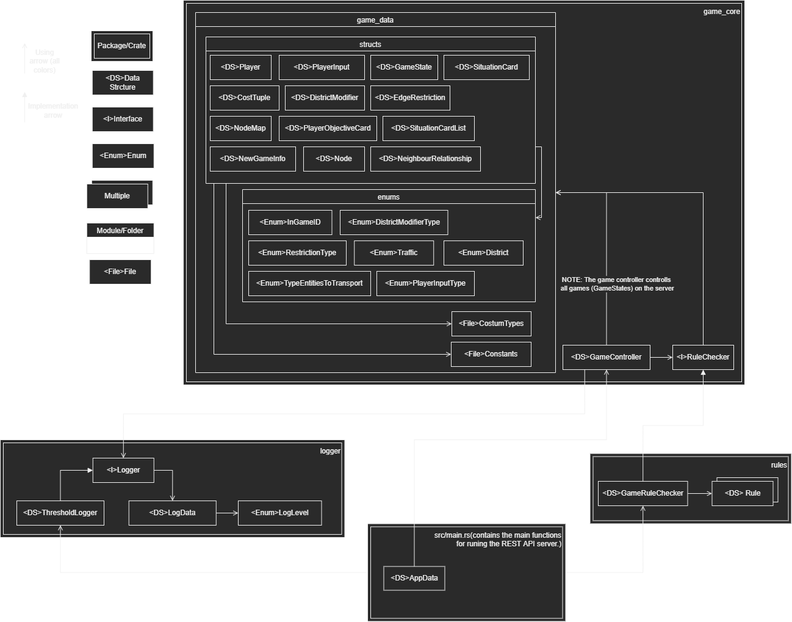

# Sintef Digital Board Game

## Introduction

This is the code repository for the back end server for Sintef Digital Board game. This is a collaboration project with 6 students taking the IT2901 - Informatics Project II course on NTNU.

## Technology stack

The code is written in the [Rust](https://www.rust-lang.org) language, and is using the [Actix Web](https://actix.rs) framework for communication between the client and server. Actix provides a HTTP server which is running on the HTTP/1.1 protocol, although the technology is capable of running HTTP/2.0.

Rust is blazingly fast and memory-efficient: with no runtime or garbage collector, it can power performance-critical services, run on embedded devices, and easily integrate with other languages.
Rust’s rich type system and ownership model guarantee memory-safety and thread-safety — enabling you to eliminate many classes of bugs at compile-time.
Rust has great documentation, a friendly compiler with useful error messages, and top-notch tooling — an integrated package manager and build tool, smart multi-editor support with auto-completion and type inspections, an auto-formatter, and more (src: [https://www.rust-lang.org](https://www.rust-lang.org)).

[Actix Web](https://actix.rs) is a powerful, pragmatic, and extremely fast web framework for Rust. What makes Actix so powerful is that values do not have to be passed around using strings. Instead, everything has a type. Actix also provides features for HTTP/2, logging, etc (src: [https://actix.rs](https://actix.rs)).

## Server overview

The image above shows the rough structure of the server. For the sake of visibility we've not added all the dependency arrows.

We've done our best to try and make the system as flexible as possible. The `game_core` crate contains all the data needed for playing the game, whilst the `rules` crate contains the rules for the game.

- If you want to change the map used, you need to define a new node map in the `NodeMap` struct in `game_core->src->game_data->structs->node_map.rs->NodeMap`, and we suggest that you take a look at how the previous default map (created using `NodeMap::new_default()`) is defined and make a new map in a similar way.
- If you want to add a situation or objective card, you can do so by going to `game_core->src->situation_card_list.rs` and add or remove situation cards there. Note that the `SituationCard` and `SituationCardList` is defined the structs folder/module, but the default list of situation cards is not defined there. We realize this is not the best solution, but we do not have more time to refactor this and test the server properly.
- If you want to change the max amount of players you can do so by changing the constant in `game_core->src->game_data->constants.rs`.
- If you want to change how many moves a player should have to begin with, you can also do so in the same `constants.rs` file.
- If you want to add or remove vehicle or restriction types you can do so by adding or removing types in the `game_core->src->game_data->enums->restriction_types.rs->RestrictionTypes`.
- And so on...

Rust should automatically detect if not all enum cases are handled or objects are not defined or used correctly. This will usually be done through compilation errors. However, if there is some new game logic, then it needs to be defined in the `GameRuleChecker` in the `rules` crate. If you want to do this, then we suggest that you take a look at the `GameRuleChecker` implementation and how it works, it should be easy to understand if you've familiarized yourself with the Rust programming language. Note that some of the game logic is defined in the `GameController` in `game_core`, this is not the best solution, but we do not have the time to refactor it and test the server at this point. However, since Rust does not crash/throws errors like other programs, most errors that can occur will have some data, usually strings, that will tell what the problem was. This makes it easier to know where the problem was and how to fix it.

### src/main.rs

This file contains what we can call the "server". Here the REST-API endpoints/functions are defined and added to the server.

### game_core

This crate (aka. package), contains all the data-structures relevant for the server. This crate contains multiple modules and sub-modules with different data seperated for the sake of clarity.

### rules

This crate contains all the rules for the server. Note that Rust does not have interfaces, but uses something else instead. It's called Traits and works very similarly to interfaces.

### logger

This crate contains an interface for logging across the server and an implementation of the Logger trait, called ThresholdLogger which logs data based on if the data that is trying to be logged crosses a threshold defined when instantiating the ThresholdLogger.

## Documentation
It's possible to generate a interactible website using `cargo doc --open`, which should open the interactible documentation website in your default browser once the website is compiled. More information about how `cargo doc` works can be found [here](https://doc.rust-lang.org/cargo/commands/cargo-doc.html). The code documentation is ofcourse still available in the code itself.

## Installing and running the server

1. Clone this repository at the desired location.
2. Install the Rust programming language by following [these](https://www.rust-lang.org/learn/get-started) steps.
3. Make sure that you set the `const SERVER_IP` to your ip in `src/main.rs`. If you do not do this, you might not be able to connect to the server.
4. Start the server in release mode (the fastest) using `cargo run --release`.
5. Alternatively, you can build the server using `cargo build --release` and then run the binary in <path_to_server>/target/release/. If you are using Ubuntu, you might need run `chmod u+x <path_to_server_binary>`.
6. On Ubuntu you can also start the server-binary as a service by following the steps [here](https://askubuntu.com/a/1314957).

## Installing and running the client server

1. Install apache2 on your computer and configure it. On Ubuntu it's recommended to follow [this](https://ubuntu.com/tutorials/install-and-configure-apache#1-overview) tutorial.
2. Clone the repository at a desired location.
3. Change the IP to the back-end-server's IP in the `RestAPI.cs` script.
4. Build the project for WebGL. If you are unsure about how to do this, you can follow [this tutorial](https://learn.unity.com/tutorial/creating-and-publishing-webgl-builds#62a05565edbc2a1471677a7b) to step 5.
5. Copy the WebGL build files into the directory you made in step 1 in the tutorial.
6. Start/Restart the apache2 server. You should now be able to play the game in a browser when connecting to the IP of the apache2 server.

## ⚠ Disclaimer about caching

As the client server runs on WebGL, caching can become an issue as it runs an older snapshot of the game which does not have the latest features. In order to circumvent this problem, a reload requesting all files will be necessary after an update (typically achieved with the CTRL+R hotkey in your web browser).

## The REST-API documentation

The API is documented using [Swagger](https://swagger.io). In order to read the documentation in its original format, you have to use the [Swagger Editor](https://swagger.io/tools/swagger-editor/). While on the website, just click on **Try Swagger Editor** and paste the contents of the [APIdoc.yaml](APIdoc.yaml) file.

## Need help?

Please let us know and we will try to help if we can.
